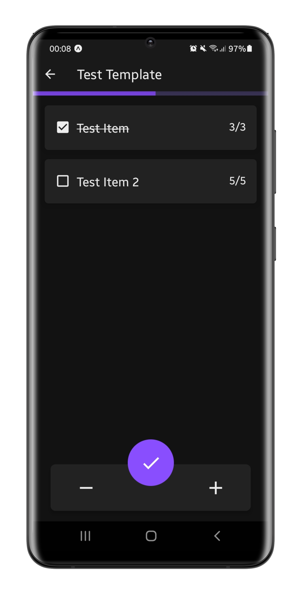

    <h1>Listate</h1>
    
    <h1>Check</h1>
    
    <h1>Log</h1>
    

&nbsp;
## 🔧 Setup:
- Clone this repository: 
`git clone https://github.com/z3oxs/listate` or Download ZIP and unzip;  
- Move to repository: 
`cd listate`  
- Install all NodeJS dependencies: 
`npm install` or `yarn install`  
- Run: 
`yarn start` 
