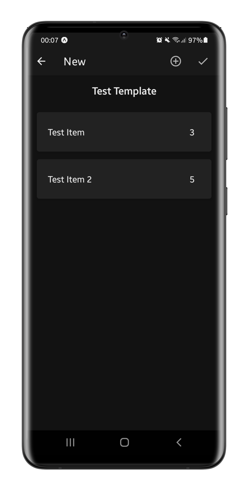

    
    

## 🤔 What's this?
- An app to create and manage items checklists, like supermarket lists, completely **OFFLINE**.

&nbsp;
## ♻️ Changelog v1.0.4
- Added ripple effect to buttons
- Valid input checking
- Scrollviews now follow the bottom
- New page to reconfigure a template

&nbsp;
## 🔧 Setup:
- Clone this repository: 
`git clone https://github.com/z3oxs/listate` or Download ZIP and unzip;  
- Move to repository: 
`cd listate`  
- Install all NodeJS dependencies: 
`npm install` or `yarn install`  
- Run: 
`yarn start` 
